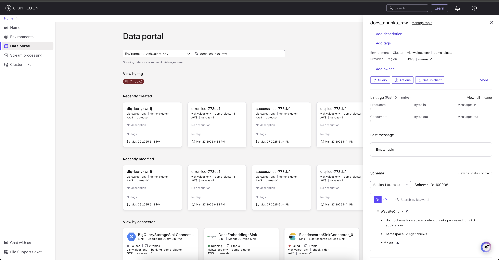
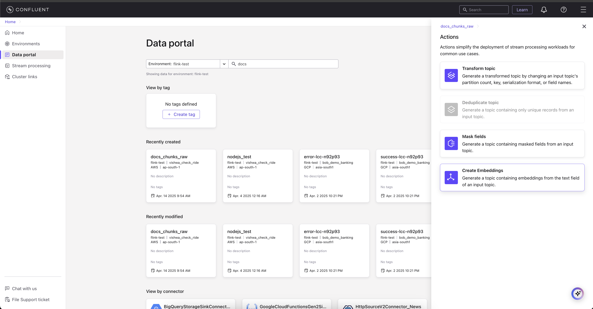

# FluentRAG: Real-time Documentation Assistant with Confluent Cloud

FluentRAG is a real-time documentation assistant built with Confluent Cloud, MongoDB, and OpenAI.
This demo showcases how users can use Confluent Cloud to build a real-time RAG pipeline with databases like MongoDB that support vector storage and search. In this particular demo, we are using eGet to scrape and chunk web data and produce it to a Kafka topic, then Confluent Flink generates the embeddings for it as we set up in Confluent's data portal. Then we put the relevant data and its embeddings in another topic. We use Confluent MongoDB sink connector to put embeddings and data into MongoDB, and then use MongoDB's vector search to build RAG on top of it. Because of Confluent Cloud's real-time RAG pipeline, applications will always have the latest data available for users.RetryClaude can make mistakes. Please double-check responses.

## System Architecture


FluentRAG uses Confluent Cloud to stream processed document chunks in real-time, enabling a seamless content ingestion pipeline:

1. **Web Content Processing**: URLs are processed by the eGet Chunker API
2. **Real-time Streaming**: Document chunks are streamed to Confluent Cloud and embeddings are generated in realtime
3. **Vector Database Storage**: Chunks are stored in MongoDB with vector indexes
4. **Retrieval & Generation**: User queries trigger vector search and LLM generation

## Prerequisites

- Python 3.9+
- Confluent Cloud account with Kafka cluster
- MongoDB Atlas account with vector search enabled
- OpenAI API key
- Docker for running the eGet Chunker API

## Getting Started

### 1. Clone the Repository

```bash
git clone https://github.com/yourusername/fluentrag.git
cd fluentrag
```

### 2. Set Up the eGet Chunker API

The system relies on the [eGet-Crawler-for-ai](https://github.com/vishwajeetdabholkar/eGet-Crawler-for-ai) for processing URLs. Follow these steps to run it locally:

```bash
# Clone the eGet repository
git clone https://github.com/vishwajeetdabholkar/eGet-Crawler-for-ai.git
cd eGet-Crawler-for-ai

# Start the Docker container
docker-compose up -d
```

This will run the chunker API at http://localhost:8000.

### 3. Configure Confluent Cloud

You need a Confluent Cloud account with:
- A Kafka cluster (Standard or above)
- Create a topic named `docs_chunks_raw` with 3 partitions
- Create and save API keys for confluent kafka cluster and schema registry. Add them to config.json file
- Create embeddings using below visual guides in conflunet cloud.


<video controls src="resources/conflunet_embeddings.mp4" title="Step 4"></video>

### 4. Set Up MongoDB

- Create a MongoDB Atlas cluster with vector search capability
- Create a database named `confluent_embeddings`
- Create a collection named `confluent_docs`
- Set up a vector index for the collection

### 5. Configuration

Copy the sample `config.json` and update it with your credentials:

```json
{
  "kafka_bootstrap_servers": "YOUR_BOOTSTRAP_SERVER",
  "kafka_api_key": "YOUR_KAFKA_API_KEY",
  "kafka_api_secret": "YOUR_KAFKA_API_SECRET",
  "kafka_topic": "docs_chunks_raw",
  "chunker_api_url": "http://localhost:8000/api/v1/chunk",
  "schema_registry_url": "YOUR_SCHEMA_REGISTRY_URL",
  "schema_registry_api_key": "YOUR_SCHEMA_REGISTRY_API_KEY",
  "schema_registry_api_secret": "YOUR_SCHEMA_REGISTRY_API_SECRET",
  "mongodb_uri": "YOUR_MONGODB_URI",
  "mongodb_database": "confluent_embeddings",
  "mongodb_collection": "confluent_docs",
  "openai_api_key": "YOUR_OPENAI_API_KEY",
  "openai_model": "gpt-4o-mini",
  "openai_timeout": 30
}
```

### 6. Install Dependencies and Run

```bash
# Create a virtual environment
python -m venv venv
source venv/bin/activate  # On Windows: venv\Scripts\activate

# Install dependencies
pip install -r requirements.txt

# Run the application
python app.py
```

The Streamlit UI will be available at http://localhost:8501.

## Features

- **Real-time Content Processing**: Process any web URL into structured document chunks
- **Streaming with Confluent Cloud**: Real-time data flow with Avro serialization
- **Semantic Search**: Vector search for finding the most relevant content
- **Documentation Assistant**: AI-powered responses based on retrieved content
- **URL Management**: Track and review processed URLs

## How It Works

The system leverages Confluent Cloud's event streaming platform to create a real-time RAG pipeline:

1. **Content Ingestion**:
   - URLs are processed through the eGet Chunker API
   - Content is split into semantic chunks with metadata

2. **Confluent Cloud Streaming**:
   - Chunks are serialized with Avro schemas
   - Kafka guarantees ordered, reliable data streaming
   - Schema Registry ensures data compatibility
   - As soon as data is ingested in `docs_chunks_raw` embeddings for chunks are created and stored in another topic `docs_chunks_raw_embedding`
   - Use Confluent Cloud sink connector for Mongo to store embeddings and relevent data in database.

3. **Vector Database**:
   - MongoDB vector indexes enable semantic search
   - Document chunks are enriched with embeddings

4. **Query Processing**:
   - User queries are evaluated to determine search needs
   - Queries are optimized for vector search
   - Retrieved contexts provide grounding for LLM responses

5. **Response Generation**:
   - OpenAI models generate factual, relevant responses
   - Responses are displayed in the Streamlit UI
  


Check the Linkedin post for a [quick demo](https://www.linkedin.com/posts/vishwajeetdabholkar_realtime-rag-kafka-activity-7300389340679933952-JUDy?utm_source=share&utm_medium=member_desktop&rcm=ACoAABxsm4oBtJCYOJB9BKISaNj92UD-a7MOGcw)
